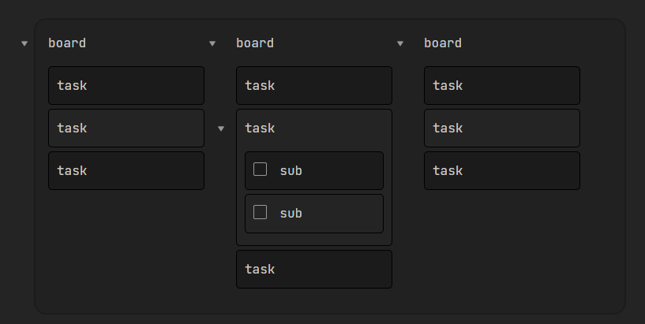

# Welcome to Spectrum Obsidian Theme 👋

[](https://github.com/Braweria/Spectrum#readme)
[](https://github.com/Braweria/Spectrum/graphs/commit-activity)
[](https://github.com/Braweria/Spectrum/blob/master/LICENSE)
[](https://twitter.com/braweria)

> An Obsidian Theme

- 🏠 [My Homepage](https://braweria.de)

- ✨ [Forum Thread with Changelogs](https://forum.obsidian.md/t/spectrum-an-obsidian-theme-new-feat-floating-images/12688https://forum.obsidian.md/t/12688)

## Content

- [Contributing](#-Contributing)
  - [Get Started](#Get-Started)
  - [How to compile](#How-to-compile)
- [Author](#Author)
- [Show your support](#Show-your-support)
- [License](#-License)
- [Features of this Theme](#Features-of-this-Theme)
  - [Font](#Font)
  - [Kanban](#Kanban)
  - [Floating Images](#Floating-Images)

## 🤝 Contributing

Contributions, issues and feature requests are welcome!

Feel free to check [issues page](https://github.com/Braweria/Spectrum/issues). You can also take a look at the [forum thread](https://forum.obsidian.md/t/12688).

### Get started 

```node
git clone https://github.com/Braweria/Spectrum.git
npm install
```

### How to compile

```node
npm run scss
```

## Author

👤 **Wiktoria Mielcarek**

* Website: https://braweria.de/
* Twitter: [@braweria](https://twitter.com/braweria)
* Github: [@Braweria](https://github.com/Braweria)
* LinkedIn: [Wiktoria Mielcarek](https://linkedin.com/in/wiktoria-mielcarek)


## Show your support

Give a ⭐️ if this project helped you!


## 📝 License

Copyright © 2021 [Wiktoria Mielcarek](https://github.com/Braweria).

This project is [MIT](https://github.com/Braweria/Spectrum/blob/master/LICENSE) licensed.

## Features of this Theme

Some features for this theme are not self-explanatory. Seeing a different colour for the heading is one thing, but what about the hidden features you wouldn't know unless someone told you about it? That's what this section is for.

### Font

This Theme is build with the [JetBrains Mono](https://www.jetbrains.com/lp/mono/) font in mind. I recommend installing it. If you do not want to install the font, the next best monospace font will be used.


### Kanban

With this theme you can create your very own wannabe kanban board! To create one, all you have to do is to set the `cssclass` to `kanban` inside your YAML frontmatter.

```yaml
___
cssclass: [kanban]
---
```

Then you can start creating an unordered list, which will represent your kanban board. The vers first level of list items, are the boards. Every item a level deeper, represent the task or the subtask.

```md
- Ideas
  - checklists
  - external links
- To-Do
  - git push
  - preview image for spectrum
- Doing
  - write the README
- Done
  - features of spectrum
    - Kanban
    - Floating Images
```



### Floating Images

When writing a lot of text, someone images have to be inserted to break up the paragraphs. Sometimes those images should be on the left or right of the text, with the text wrapping around it. Now it is possible! All you have to do is to give it the alternative text.

```md

```
```md

```

This is also possible with wikilinks of images that are already inside your vault!

```md
![[kanban.jpg|float-right]]
![[kanban.jpg|float-left]]
```

*Note: If your image is wider than the note itself, you will have to give it a smaller width for the floating to work. You might also have to either refresh Obsidian or just switch notes real quick, to see the changes. Sometimes Obsidian doesn't live-reload the alternative text.*

***
_This README was generated with ❤️ by [readme-md-generator](https://github.com/kefranabg/readme-md-generator)_