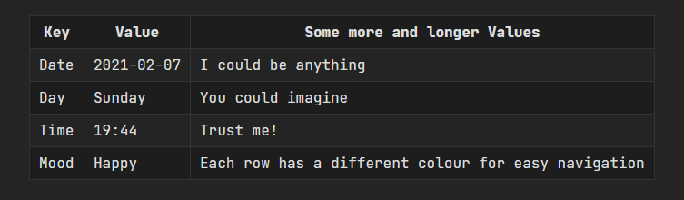
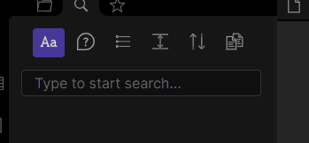
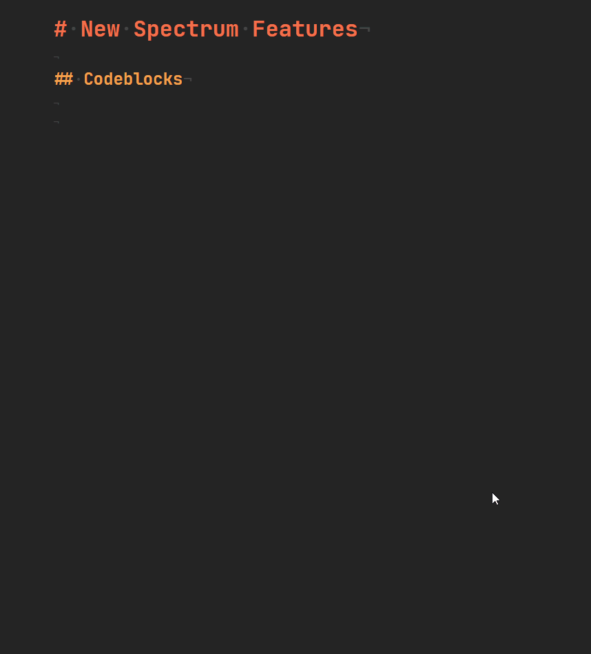
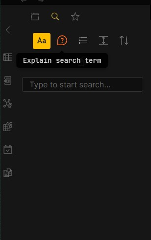
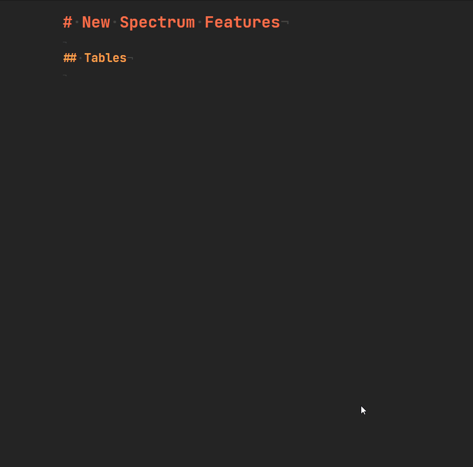

# Spectrum

_/ˈspɛktrəm/_

noun

1. a band of colours, as seen in a rainbow, produced by separation of the components of light by their different degrees of refraction according to wavelength.
2. used to classify something in terms of its position on a scale between two extreme points.

- "the left or the right of the political spectrum"

## Introduction

Just like a Spectrum, the way you take notes can expand everywhere. And looking at it _can_ become dull, so why not freshen it up a bit and also increase your productivity?  
**Spectrum** ist meant to help with productivity, as well as to make the way you look at your notes more exciting. Easily distinguish between strong or emphasised text. Know the difference between internal and external links, just by a quick glance! _And there is more._

## Tables

The tables were styled, so that **you** have a better time looking at your data, instead of _searching_ for your data. And with just a quick mouse hover, you see what row you're on.

## Search Navigation

The Search Navigation Bar was fixed with this styling. Before it was possible to hide icons when shrinking the sidebar, but not anymore! Now the Icons will just wrap to the next row and still be visible to you.

## Query

The Query search got the same improvement as the table. Each row has a different colour, so you can easily distinguish between them.

## Scrollbar

The Scrollbar has decreased in size, so it doesn't stand as promiment as before.

## Body

### Line Height

The Line Height was increased, for better readability of your notes.

### Preview Text

The body text for the preview was widened, so you can see more at once when reading.

## Font

I recommened to use the [JetBrains Mono Font](https://www.jetbrains.com/lp/mono/), which was developed as a typeface for developers. But that is highly Optional. Your System Default monospace font will be used instead.

## Folder Icons

The folders in the sidebar now have an open and closed folder icon, depending on their state!

## Style Preview

### Additional Notes

The Stylesheet is still under development and being improved over time. Don't hesitate to send an issue, if you have suggestions.

---

## Changelog v0.6.0 - 2021.02.11

### Codeblocks

Codeblocks have been updated, they now have a softer colour and are easier on the eyes, while writing. Also a border was added as well as what language the type of code represents at the bottom right.

## Changelog v0.7.0 - 2021.02.12

### Workspace Sidebars

The Workspace banners and ribbons both have now the same colour, to create lease friction. Also the icons for them have been updated as well.

### Tables

The tables have gotten a small update, they are now at full width of the Note. No more different sized tables in the same note, creating a weird balance.

## Changelog v0.8.0 - 2021.02.15

### Paragraphs

The text colour of the text was updated to a more calmer colour, with less contrast to the background. The first line of a paragraph now has a text identation, so you can more easily identify where a paragraph starts!

### Lists

The list items now are no longer so close to each other.

### Mermaid

A Mermaid Chart is now displayed at the center of your note, giving you the information you need!

### Embed Notes

Embed Notes are now more easily recognised with a border around them.

## Changelog v0.9.0 - 2021.02.16

### Highlight

Fixed the highlight colour to be a bit brighter. Fixed also, that the colour for Strong and Emphasis was not being seen correctly within a highlight. Those two now have better colours.

### Blockquote

The blockquote now has a width of 1px all around it.

### Text Cursor Indicator

The Text Cursor Indicator is now yellow, fitting for the theme!

## Changelog v0.10.00 - 2021.02.17

### Graph View

Now with coloured groups, the background of the Graph should be something where a ton of different colours can work together. That's why I made it darker.

### Workspace

The Note Header now has hard corners, instead of rounded corners. And the Ribbons left and right no longer have the bright border. Everything is more seemless.

The Ribbons left and right, have been updated. Now the Collapse Button is in the center of the ribbon and takes 100% of the available room. This makes it clicking easier from every point.

