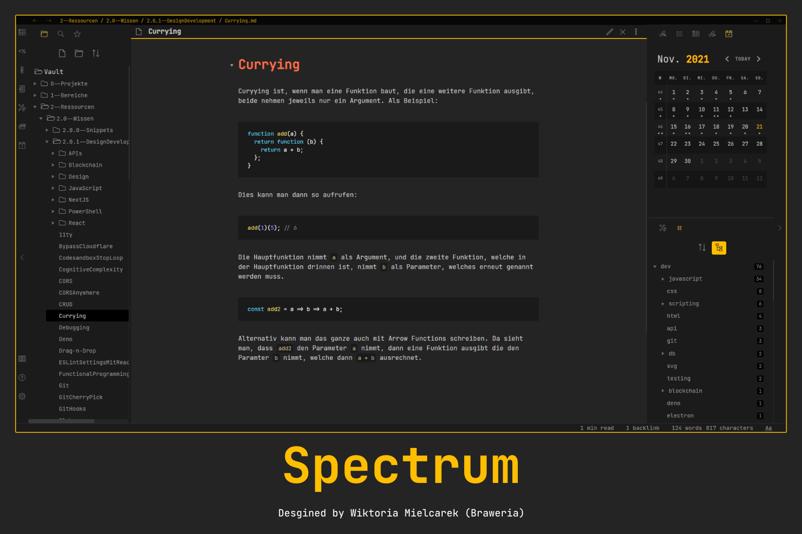

# Welcome to Spectrum Obsidian Theme 👋
   [](https://twitter.com/braweria)  
 [](https://github.com/Braweria/Spectrum/wiki)
[](https://github.com/Braweria/Spectrum/graphs/commit-activity)
[](https://github.com/Braweria/Spectrum/blob/master/LICENSE)  

This theme is no longer maintained by me, but kept open for anyone to submit PRs for fixes and improvements.

Spectrum is a theme for Obsidian and is designed the way to boost productivity and to improve the App to the needs I am having at the time. As such styling decision are opinionated.

Spectrum is coming with a variaty of features, like different checkboxes and support for image styling. [Read more in the documentation.](https://github.com/Braweria/Spectrum/wiki)



[](https://ko-fi.com/braweria)

- [✨ Release Notes](https://github.com/Braweria/Spectrum/releases)

## Content

- [Features](#Features)
- [Contributing](#Contributing)
  - [Get Started](#Get-Started)
  - [How to compile](#How-to-compile)
- [Author](#Author)
- [License](#License)
- [Places where Spectrum was mentioned](#Places-where-Spectrum-was-mentioned)


## Features

Go check out the Wiki to see what features this theme has.  

--> https://github.com/Braweria/Spectrum/wiki
## Contributing

Contributions, issues and feature requests are welcome!

Feel free to check [issues page](https://github.com/Braweria/Spectrum/issues). You can also take a look at the [forum thread](https://forum.obsidian.md/t/12688).

You want to contribute financially? Sure! You can [tip me whatever amount on Ko-Fi!](https://ko-fi.com/braweria)

Give a ⭐️ when you like this theme!
### Get started 

```sh
git clone https://github.com/Braweria/Spectrum.git
cd Spectrum
yarn
```

### How to compile

Spectrum uses [esbuild](https://esbuild.github.io) to build and compile all styles into a minified version, making the filesize smaller.

**For development**

This will build the CSS file into the `/development/spectrum-testing.css`, which is ignored by git.

```sh
yarn dev
```

**For building**

When you're done working, make a PR and if it gets accepted and merged, autiomation will kick in and build a new CSS file.

## Author

👩‍💻 **Wiktoria Mielcarek**

* [Twitter](https://twitter.com/braweria)
* [GitHub](https://github.com/Braweria)
* [LinkedIn](https://linkedin.com/in/wiktoria-mielcarek)

## License

Copyright © 2022 [Wiktoria Mielcarek](https://github.com/Braweria).

This project is [MIT](https://github.com/Braweria/Spectrum/blob/master/LICENSE) licensed.

## Places where Spectrum was mentioned

Spectrum is slowly starting to become a theme liked by many users of Obsidian. Here are some online places, where Spectrum was being mentioned:

- [Top 8 Beautiful Obsidian Themes](https://www.youtube.com/watch?v=JgtyQeWkXxE) by Filipe Donadio
- [Obsidian Roundup 2021-11-13](https://www.obsidianroundup.org/2021-11-13-wysiwyg-called-live-preview-is-here/) by Eleanor Konik
- [Obsidian Roundup 2021-11-20](https://www.obsidianroundup.org/2021-11-20/) by Eleanor Konik
- [All the Obsidian themes and CSS explained](https://youtu.be/W7OUgdvXh0o?t=5223) by Danny Hatcher